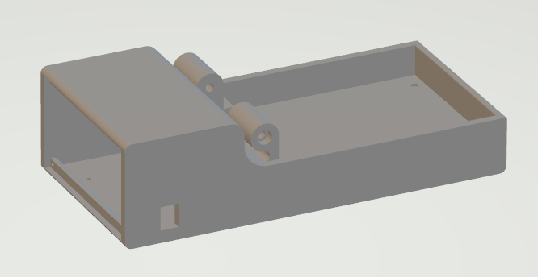
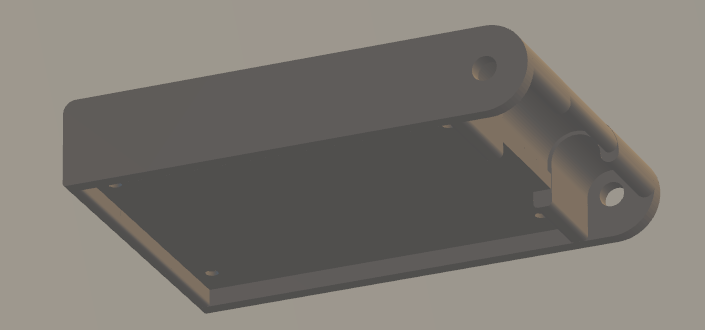
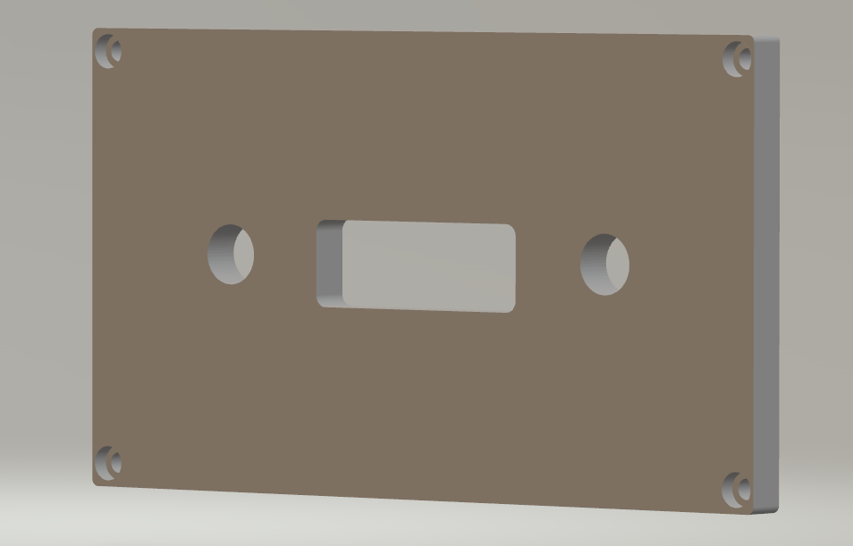

# 3D printable parts

Miriam is composed of 3 pieces that can be 3D printed.

## base.stl

Base is where the mid heating and optic PCBs are located and where the plate to run the assay comes to. It also houses the Arduino Mega and its control shield in the back of the case. 

The outer dimensions of the base are 275 x 132 x 75 mm.

## upper.stl 

This is the cover of the case that houses the upper heating board. The outer dimensions are 191 x 132 x 35 mm.

## cover.stl

Cover is meant to hide the Arduino mega and shield in the back of the case. The dimensions are 6 x 120 x 67 mm.

