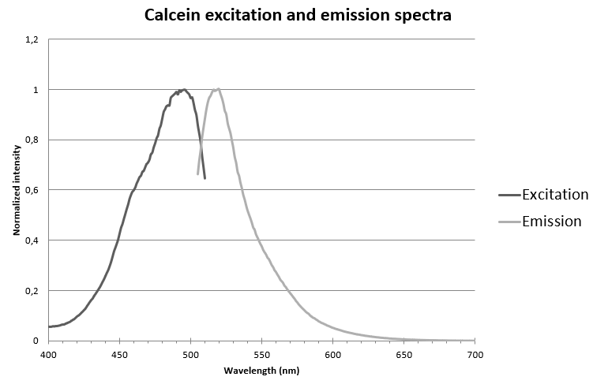
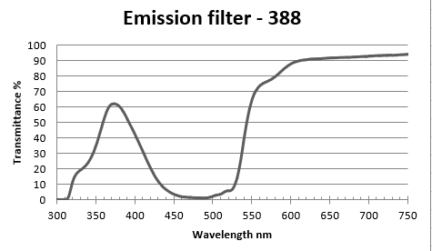
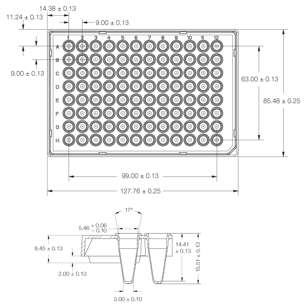
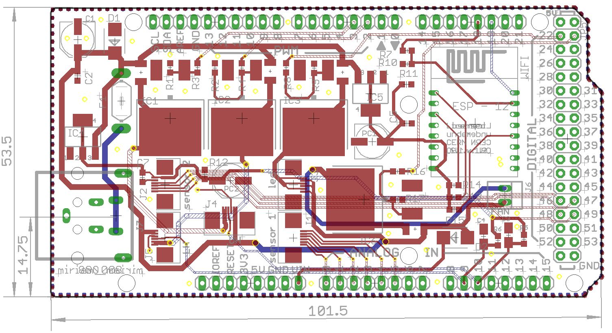
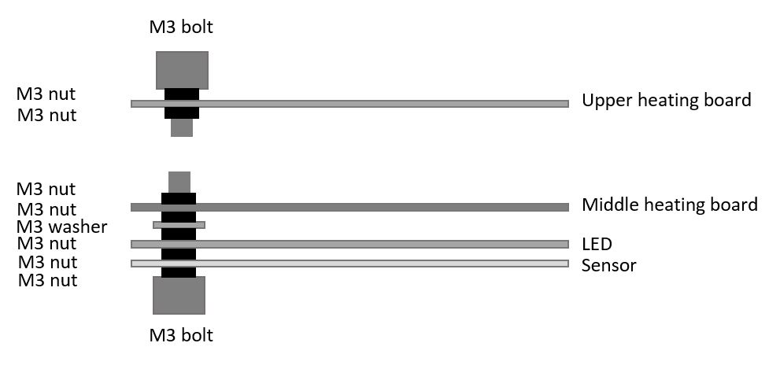

Miriam
========

Copyright Miroculus Inc.2016
Based on original work from Arduino (Sweden)

This documentation describes Open Hardware and is licensed under the CERN OHL v. 1.2.

Licensed under CERN OHL v.1.2

You may redistribute and modify this documentation under the terms of the [CERN OHL v.1.2.](http://ohwr.org/cernohl). This documentation is distributed WITHOUT ANY EXPRESS OR IMPLIED WARRANTY, INCLUDING OF MERCHANTABILITY, SATISFACTORY QUALITY AND FITNESS FOR A PARTICULAR PURPOSE. Please see the CERN OHL v.1.2 for applicable conditions

## Introduction

Miriam is an open-source instrument for isothermal amplification reactions. The assays Miriam was designed to execute are based on LAMP and Elisa protocols. Miriam is controlled with [Arduino](http://www.arduino.cc/) Mega and the production costs per instrument are blow 200USD.

The detection optics have been designed for [calcein dye](http://loopamp.eiken.co.jp/e/products/fluore/index.html). The selected LED is an angle SMD led with peak wavelength 461nm. The photodiode is an RGB photodiode most sensitive to green light. The optics also include an emission filter utilized in theatrical lighting.

In the performance testing of Miriam, the detection limit for DNA using LAMP as amplification platform has been 2amol in 10ul of sample (figure 1).

**Figure 1.** LAMP reaction with 2amol DNA input, fluorescence measured every 2 minutes (y, Normalized signal and x, cycle (2 min).

For more information, you can contact us by completing the form [here](https://miroculus.com/#contact). You can also follow Miroculus on [twitter](https://twitter.com/miroculus) or like us on [facebook](https://www.facebook.com/miroculus).

To report a *bug* in the software or to request *a simple enhancement* go to the [issues](http://github.com/miroculus/Miriam/issues) section

If you're interested in modifying or extending the Miriam platform, we strongly suggest you to send us an email discussing your ideas. That way you can coordinate with our team and others, giving your work a higher chance of being integrated into the official release.

## Design

The optics of Miriam are designed to support calcein dye. Calcein emission and excitation spectra are represented in Figure 2.

**Figure 2.** Calcein normalized emission and excitation spectra.

The optical filter for blocking the excitation light has been purchased from a theatrical supply store and has the transmission spectra represented in Figure 3.

**Figure 3.** Emission filter transmission specter.

The middle heating board and the LED and PD arrangements have been designed to support 96-well plates with the following dimensions (figure 4).

**Figure 4.** 96-well plate dimensions supported by Miriam

To control the heating of Miriam there are two heater PCBs. They have been designed so that in the middle is a 10 kohm SMD thermistor and the heat is generated by current flowing through the copper traces. These traces have been designed to be so long and narrow that they create an internal resistance of few ohms. The traces are closer to each other in the edges because heat is measured from the middle and the edges of the PCB boards meet ambient air and they need to produce more heat. (Figure 5.)

**Figure 5.** Heating plates, heat is generated by trace resistance. Right: The middle heater creating the temperature required for amplification (58-68 degrees C). Left: The top heater keeping vapor from condensing to the lid, kept at 80 degrees C. 

The detection of fluorescence is done with 96 LEDs and 96 photodiodes creating LED and photodiode PCBs. The LED peak wavelength is 470 nm and photodiode is a green RGB photodiode. The measured voltage is amplified with an operational amplifier to 0-5 V that is then converted by Arduino’s 8-bit ADC to be a numerical value. (figure 6.)

**Figure 6.** LED (left) and photodiode (right) PCBs.

All of these boards are controlled by a shield that is directly mounted to the Arduino mega board (figure 7). The shield contains three MOSFETs to control LED board and the two heater boards, the required components to read the heat from the thermistors as well as a WIFI chip. The WIFI chip makes it possible for Arduino to be connected to a local WIFI and this way communicate autonomously to a web service.

**Figure 7.** The Arduino shield. The power connector is a 20-pin ATX connector that can be connected to a computer ATX power.

Installation
------------
3D print the printable parts under folder "3D model", sand them to make them align with each other. Assemble the boards as presented in the Figure 8. In the assembly cut with scissors the emission filter to fit between the LED and the sensor PCBs so that it aligns with the bolts.

**Figure 8.** PCB board assembly information.

The screws are attached to the cover and the base with heat durable epoxy. 

Credits
--------
Miriam is an open source project, supported by Miroculus in collaboration with Arduino (Sweden). The team is led by Juho Terrijarvi.

Icon and image designed by Miroculus.
